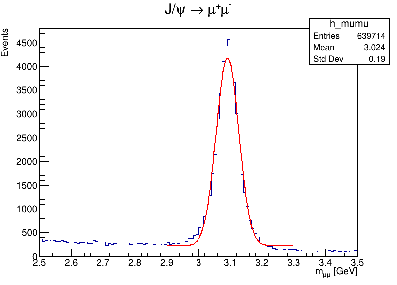
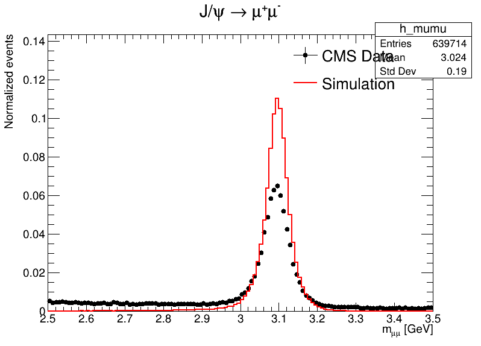

# Reconstruction and Data–Simulation Validation of  J/ψ → μ⁺μ⁻ using CMS Open Data

## Project Overview
This project performs a **detector-level reconstruction of the J/ψ meson** using **CMS Run-2 (2016) proton–proton collision data** from the **CERN Open Data Portal**.  
The analysis focuses on the decay channel **J/ψ → μ⁺μ⁻** by reconstructing the **invariant mass of opposite-sign muon pairs**.

The signal reconstructed from real collision data is compared with **Monte Carlo (MC) simulation** to validate the detector response, momentum reconstruction, and analysis process.

This project aims to provide a minimal but physically accurate CMS-style analysis using open LHC data.

---
---

## Analysis Results

### CMS Run-2 (2016) Collision Data
Invariant mass spectrum of opposite-sign muon pairs reconstructed from CMS Open Data, showing a clear J/ψ resonance near 3.1 GeV.

---

### Monte Carlo Simulation
Invariant mass spectrum reconstructed from CMS Open Data Monte Carlo samples for the J/ψ → μ⁺μ⁻ decay.

---

### Data–Simulation Comparison
Normalized overlay of collision data and Monte Carlo invariant mass distributions, demonstrating agreement in peak position and shape.

---
## Physics Background

The **J/ψ meson** is a bound state of a **charm quark and an anti-charm quark (c c̄)**.  
It is unstable and decays very quickly, so it cannot be detected directly.

One of its decay channels is:

J/ψ → μ⁺ μ⁻

Muons are measured in the CMS detector, making this decay channel ideal for:
- testing momentum reconstruction  
- validating detector resolution  
- comparing real data with simulation  

The known mass of the J/ψ is approximately **3.097 GeV**, which provides a clear reference for validation.

---
## Datasets Used

### Collision Data
- **Experiment:** CMS
- **Run period:** Run-2 (2016)
- **Primary dataset:** DoubleMuon
- **Data format:** CMS NanoAOD
- **Source:** CERN Open Data Portal

### Monte Carlo Simulation
- **Process:** J/ψ → μ⁺μ⁻
- **Data format:** CMS NanoAOD
- Includes detector simulation and reconstruction

---
## Tools and Environment

- **Programming language:** Python
- **Analysis framework:** ROOT / PyROOT
- **Data format:** CMS NanoAOD
- **Operating system:** Linux (Ubuntu)
---
## References

- CERN Open Data Portal  
- CMS NanoAOD documentation  
- Particle Data Group (PDG)

---
